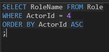
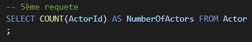

# TP-SQL
---
 

### ETAPE 1

1) Etablir le «modèle relationnel» de données (les tables, etc.)

voir le fichier "***Shéma BDD SQL.drawio***" (nécessite l'extansion **drawio**), : 

---

2) Créer le fichier SQL permettant d’implémenter votre modèle (encadré en rouge) :
   

---

1) Créer une base SQLite et injecter votre modèle sur **TablePlus** : 
2) 

* Création de la base
  

* Création des tables de la base :
 

* Mêmes choses pour les tables : **Film**, **Actor**, **Role**, **Session**, **Reservation**, **Rate**, **Spot**, **SessionCategory**, **SpotCategory**
 

---

1) Peupler votre BDD avec des données de test réalistes 

* On peuple les données de la BDD à la main, on fait la même chose pour les tables suivantes : (**Session**, **Role**, **Rate**, **SpotCategory**, **SessionCategory**, **Spot**, **Reservation**)

---
### ETAPE 2

1) Donner les dates des séances (sans répétition) des films dans lesquels l'acteur 1 joue 

***code :***

***résultat :***

---
2) Donner les films offrant des séances en semaines après 18h00 avec un tarif inférieur à 10 EUR

***code :***

***résultat :***

---
3) Donner les noms des rôles de l’acteur numéro 4 triées par ordre alphabétique

***code :***

***résultat :***

---
4) Donner les dates et les horaires des séances du film numéro 7 triées par ordre décroissant selon les dates et croissant selon les horaires

***code :***

***résultat :***

---
5) Donner le nombre d’acteurs de la BDD

***code :***

***résultat :***

---
6) Donner le titre des films projetés pendant exactement deux séances

***code :***

***résultat :***

---
7) Donner les noms et prénoms des réalisateurs qui ont travaillé avec l’acteur dont le nom est donné

***code :***

***résultat :***

---
8) Donner le classement des acteurs selon le nombre de rôle réalisés par ordre décroissant

***code :***

***résultat :***

---
9)  Réaliser une vue(View) contenant pour chaque acteur le nombre de séance où l’on a pu voir des films dans lequel il a participé. Afficher le contenu de la vue.

***code :***

***résultat :***

---
10) Ecrire un déclencheur (Trigger) qui lorsque l’on réalise une réservation sur la place n°1, le fait puis change la catégorie de la place en  catégorie spéciale. Vérifier le fonctionnement du déclencheur.

***code :***

a faire

***résultat :***

a faire